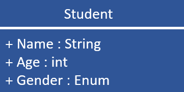

<!-- _class: title-->

# MVVM Pattern
## Nico Vogel und Lukas Sopora

12.12.19

---

# Agenda

1. Welches Problem geht MVVM an?
2. Anwendungsbereiche
3. Was ist MVVM?
  3.1. Bestandteile
  3.2. Zusammenspiel
4. Vergleich MVC und MVVM
5. Demo
6. Kritische Würdigung

<!-- 
1. was geht mvvm überhaupt an
2. wo wird es eingesetzt
3. was ist mvvm anhand von c# wpf
3.1 dabei reden wir über die bestandteile
3.2 und wie diese zusammenspielen
4. danach vergleichen wir  mvc mit mvvn
5. noch eine kleine demo
6. und zuletzt heben wir die vor und nachteile von MVVM im c# bereich hervor
-->

---

# 1. Welches Problem geht MVVM an?

Anwendungsbereich: **Entwicklung UI**

<br>
<br>

Was MVVM verbessert:

- Starke Abhängigkeit zwischen UI und Logik
- Redesign problematisch
- Cross Platform
- schwer zu testen


<!--
*Vorwort*: 
generell kommt es auf die ausgangassituation an, wie stark die folgenden punkte gewogen werden.

1. UI und Logik ist ein code, was schwer zu warten ist
2. da die UI und die logik viel miteinander zu tun haben kann man nicht einfach das design ändern. dabei zerstört man wahrscheinlich viele funktionen usw.

*schlusswort*:
wenn beispielweise Application Layer angewand wird, ist punkt 3 schonmal deutlich weniget schlimm, da man bereits eine saubere trennung zwsichen UI und Logik hat.
-->

---

# 2. Anwendungsbereiche

MVVM wird eingestzt von:

- C# WPF *(Ursprung)*
- Silverlight
- AngularJS *(nicht Angular...)*
- Delphi

<!-- 
Im weiteren werden wir alles anhand von C# WPF erläutern
 --> 

---

# 3.1. Was ist MVVM - Bestandteile?

<br>


<br>

- Informationsaustausch
  - Binding
  - Command
  - Events

<!-- 
generell lässt sich das MVVM patter in Komponenten und deren Informationsfluss aufteilen.
 -->

---

# 3.1 Was ist MVVM? - Anwendungsfall

<br>

- Verwaltung von Studentendaten im Kurs
    - "Klassenbuch"

</br>




---
<!-- _class: code -->
<span>

# 3.1. Was ist MVVM? - Model

- POJO
- Nur Daten und Daten Logik (z.B. Validierung)

</span>

```` C#
public class StudentCollection
{
    public IList<Student> Students { get; }
}

public class Student
{
    public String Name { get; set; }
    public int Age { get; set; }
    public GenderType Gender { get; set; }
}
````

---
<!-- _class: code -->
<span>

# 3.1. Was ist MVVM? - ViewModel

- Schnittstelle zwischen UI und Logik
- Zusammenführung von Daten und Funktionen 

</span>

````C#
public class StudentViewModel
{
    public StudentCollection ClassBook { get; }
    public Student SelectedStudent { get; set; }

    public StudentViewModel()
    {
        this.ClassBook = StudentTestDataUtility.GetStudentTestData();
    }
}
````

---
<!-- _class: code -->
<span>

# 3.1. Was ist MVVM? - View

- Keine Programmlogik, lediglich Rendering
- "Sucht" sich die notwendigen Informationen aus dem ViewModel

</span>

````XML
<ListView>
    <ListViewItem>
        <DockPanel>
            <TextBlock Text="Andi Theke"/>
            <TextBlock Text="19"/>
            <TextBlock Text="Male"/>
        </DockPanel>
    </ListViewItem>
</ListView>
````

---
<!-- _class: code -->
<span>

# 3.1. Was ist MVVM? - Binding

- Definition von Bindings in der View
- Informationsaustausch zwischen View und ViewModel 

</span>

````XML
<ListView ItemsSource="{Binding ClassBook.Students}">
    <ListView.ItemTemplate>
        <DataTemplate>
            <DockPanel>
                <TextBlock Text="{Binding Name}"/>
                <TextBlock Text="{Binding Age}"/>
                <TextBlock Text="{Binding Gender}"/>
            </DockPanel>
        </DataTemplate>
    </ListView.ItemTemplate>
</ListView>
````

<!-- _class: code ->
<!-- 

# 3.1 Was ist MVVM? - Bindung

- Verwendung von DataGrids
- Binding auf ausgewählten Eintrag

<span>

````XML
<DataGrid
    ItemsSource="{Binding ClassBook.Students}" 
    SelectedItem="{Binding SelectedStudent, Mode=OneWayToSource, UpdateSourceTrigger=PropertyChanged}">
</DataGrid>
````

</span>

- Binding auf ausgewählten Eintrag aus anderem Kontrollelement aus

<span>

````XML
<TextBox
    Text="{Binding SelectedStudent.Name, Mode=TwoWay, UpdateSourceTrigger=PropertyChanged}"/>
````

</span> -->


---
<!-- _class: split-->

# 3.1. Was ist MVVM? - Binding

<div class="ldiv">

## OneWay Binding

View ← ViewModel

oder

View → ViewModel
(OneWayToSource)

</div>
<div class="rdiv">

## TwoWay Binding

View ⮀ ViewModel 

</div>

--- 

<!-- _class: split -->

# 3.1. Was ist MVVM? - Events und Commands

<div class="ldiv">

## Events

<span class="text-left">

- Aufrufen von Funktionen in Code Behind der View bei bestimmten Aktionen
    - Bsp.: Clicked, OnHover, LostFocus

</span>
</div>

<div class="rdiv">

## Commands

<span class="text-left">

beschreiben was ein command ist und wie man den einsetzt

- Event: Methode in CodeBehind der View

</span>
</div>

---

# 3.2. Was ist MVVM? - Zusammenspiel

<br>

Interaktion der Komponenten:

</br>


---

# 3.2 Was ist MVVM? Einordnung Application Layer


---

<!-- _class: split -->

# 4. Vergleich MVC und MVVM

<div class="ldiv uglyfix">

### Model View Controller


</div>

<div class="rdiv uglyfix">

### Mode View ViewModel


</div>

---
<!-- _class: title -->

# 5. Demo

---
<!-- _class: split-->

# 6. Kritische Würdigung

<div class="ldiv">

## Pro

<span class="text-left">

- flexibel
- DataBinding
- steile Lernkurve (OOP, Testing)
- gut testbar

</span>
</div>

<div class="rdiv">

## Con

<span class="text-left">

- viel code für wenig resultat
- Binding eventuell laufzeitkritisch
- XAML Notation umfangreich
- OOP, Binding und Testing vorausgesetzt

</span>
</div>

<!--
Pros: 
1. die view kann einfach angepasst werden
2. die view ist komplett von der logik gerennt
3. in dem viewmodel ist die gesammte view logik, wodurch es einfach zu testen ist 

Cons:
1. die xaml notation ist umfangreich
2. um mvvm meistern zu können muss man OOP, Binding und Testing verstehen. Das ist viel für den anfang. Auch ist es wahrscheinlich, dass die ersten projekte nix werden 
 -->

---
<!-- _class: title -->

# Danke für Eure Aufmerksamkeit

<!-- 
Source:
- [pro/con](https://softwareengineering.stackexchange.com/questions/116139/what-are-the-pros-and-cons-of-the-mvvm-architecture)

 -->