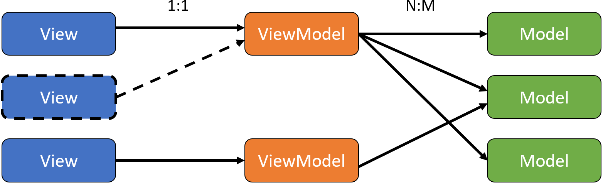

<!-- _class: title-->

# MVVM Pattern
## Nico Vogel und Lukas Sopora

12.12.19

---

# Agenda

1. Welches Problem geht MVVM an?
2. Anwendungsbereiche
3. Was ist MVVM?
  3.1. Bestandteile
  3.2. Zusammenspiel
4. Vergleich MVC und MVVM
5. Demo
6. Kritische Würdigung

<!-- 
1. was geht mvvm überhaupt an
2. wo wird es eingesetzt
3. was ist mvvm anhand von c# wpf
3.1 dabei reden wir über die bestandteile
3.2 und wie diese zusammenspielen
4. danach vergleichen wir  mvc mit mvvn
5. noch eine kleine demo
6. und zuletzt heben wir die vor und nachteile von MVVM im c# bereich hervor
-->

---
<!-- _class: code -->

# 1. Welches Problem geht MVVM an?

Anwendungsbereich: **Entwicklung UI**

<span>

Angegangene Probleme:

- Starke Abhängigkeit zwischen UI und Logik
- Redesign problematisch
- Cross Platform
- schwer zu testen

</span>

<!--
*Vorwort*: 
MVVM wird bei der Entwicklung von Applikationen mit UI angewandt.
Dabei werden einige Probleme angegangen:
Generell kommt es auf die ausgangassituation an, wie stark die folgenden punkte gewogen werden.

1. UI und Logik ist ein code, was schwer zu warten ist
2. da die UI und die logik viel miteinander zu tun haben kann man nicht einfach das design ändern. dabei zerstört      man wahrscheinlich viele funktionen usw.
   Auch ist eine Abstraktion der View in vielen Fällen nicht möglich
3. Zudem gibt es Frameworks, wie CrossMVVM, die die Anwendung des Patterns auf Cross Platform ermöglichen
4. Außerdem kann man durch die Trennung von UI und Logik die Logik automatisiert testen


*schlusswort*:
wenn beispielweise Application Layer angewandt wird, ist punkt 1 schonmal deutlich weniger schlimm, da man bereits eine saubere trennung zwsichen UI und Logik hat.
-->

---

# 2. Anwendungsbereiche

MVVM wird eingesetzt von:

- C# WPF *(Ursprung)*
- Delphi
- Silverlight
- AngularJS *(nicht Angular...)*

<!-- 
*Wo wird MVVM konkret angewandt?*

1,2: MVVM ursprünglich als Erweiterung des Presentation-Model Pattern von Martin Fowler (2004; 2005)
     Dort wurde es in C# mit WPF und MS Silverlight eingesetzt.
1.   In Delphi, was eigentlich schon ausgestorben ist, wurde MVVM verwendet
2.   Aber auch im Web Bereich ist das Pattern anzutreffen. bspweise bei AngularJS

Im weiteren werden wir alles anhand von C# WPF erläutern
 --> 

---

# 3.1. Was ist MVVM - Bestandteile?

<br>


<br>

- Informationsaustausch
  - Binding
  - Command
  - Events

<!-- 
generell lässt sich das MVVM patter in Komponenten und deren Informationsfluss aufteilen.
 -->

---

# 3.1. Was ist MVVM? - Anwendungsfall

- Verwaltung von Studentendaten im Kurs
    - "Klassenbuch"


---

# 3.1. Was ist MVVM? - Model

<span class="code">
<span>

- POJO
- Nur Daten und Daten Logik (z.B. Validierung)

</span>

```` C#
public class StudentCollection
{
    public IList<Student> Students { get; }
    public IList<Student> StudentsFullAge { get {
        return this.Students.where(x => x.Age >= 18).toList();
    }}
}
public class Student
{
    public String Name { get; set; }
    public int Age { get; set; }
    public GenderType Gender { get; set; }
}
````

</span>

---

# 3.1. Was ist MVVM? - ViewModel


<span class="code">
<span>

- Schnittstelle zwischen UI und Logik
- Zusammenführung von Daten und Funktionen 

</span>

````C#
public class StudentViewModel
{
    public StudentCollection ClassBook { get; }
    public Student SelectedStudent { get; set; }
    public ICommand DeleteCommand { get; private set; }

    public StudentViewModel()
    {
        this.ClassBook = StudentTestDataUtility.GetStudentTestData();
    }
}
````

</span>

---

# 3.1. Was ist MVVM? - View


<span class="code">


- Keine Programmlogik, lediglich Rendering


````XML
<ListView>
    <ListViewItem>
        <DockPanel>
            <TextBlock Text="Andi Theke"/>
            <TextBlock Text="19"/>
            <TextBlock Text="Male"/>
        </DockPanel>
    </ListViewItem>
</ListView>
````

</span>

---

# 3.1. Was ist MVVM? - Binding


<span class="code">
<span>

- Informationsaustausch zwischen View und ViewModel 
- View "Sucht" sich die notwendigen Informationen aus dem ViewModel

</span>

````XML
<Window.DataContext>
    <viewModels:StudentViewModel/>
</Window.DataContext>

<ListView ItemsSource="{Binding ClassBook.Students}">
    <ListView.ItemTemplate> <DataTemplate>
            <DockPanel>
                <TextBlock Text="{Binding Name}"/>
                <TextBlock Text="{Binding Age}"/>
                <TextBlock Text="{Binding Gender}"/>
            </DockPanel>
    </DataTemplate> </ListView.ItemTemplate>
</ListView>
````

</span>

---
<!-- _class: split-->

# 3.1. Was ist MVVM? - Binding

<div class="ldiv">

## OneWay Binding

View ← ViewModel

oder

View → ViewModel
*(OneWayToSource)*

</div>
<div class="rdiv">

## TwoWay Binding

View ⮀ ViewModel 

</div>

--- 

<!-- _class: split -->

# 3.1. Was ist MVVM? - Events, Commands

<div class="uglyLeft">

## Events

<span class="text-left">

- Aktion triggert Methode in Code Behind der View
    - Bsp.: Clicked, OnHover, LostFocus

````XML
<Button 
    Click="btnClicked"/>              
````

</span>
</div>

<div class="uglyRight">

## Commands

<span class="text-left">

- Binding Aktion an Methode im ViewModel
    - meist Button Events
<br>
````XML
<Button 
    Command="{Binding ClickCommand}"/>
````

</span>
</div>

---

# 3.2. Was ist MVVM? - Zusammenspiel

<br>

Interaktion der Komponenten:

</br>



---

# 3.2. Was ist MVVM? Einordnung Application Layer


---

<!-- _class: split -->

# 4. Vergleich MVC und MVVM

<div class="ldiv uglyfix">

### Model View Controller


</div>

<div class="rdiv uglyfix">

### Mode View ViewModel


</div>

---

# 5. Demo

Aufbau der Demo Applikation:

</br>


---
<!-- _class: split-->

# 6. Kritische Würdigung

<div class="ldiv">

## Pro

<span class="text-left">

- flexibel
- steile Lernkurve (OOP, Testing, Binding)
- gut testbar

</span>
</div>

<div class="rdiv">

## Con

<span class="text-left">

- viel code für wenig resultat
- XAML Notation umfangreich
- Binding undurchsichtig

</span>
</div>

<!--
Pros: 
1. die view kann einfach angepasst werden und ist komplett von der logik gerennt
2. in dem viewmodel ist die gesammte view logik, wodurch es einfach zu testen ist 

Cons:
1. die xaml notation ist umfangreich
2. um mvvm meistern zu können muss man OOP, Binding und Testing verstehen. Das ist viel für den anfang. Auch ist es wahrscheinlich, dass die ersten projekte nix werden 
 -->

---
<!-- _class: title -->

# Danke für Eure Aufmerksamkeit

<!-- 
Source:
- [pro/con](https://softwareengineering.stackexchange.com/questions/116139/what-are-the-pros-and-cons-of-the-mvvm-architecture)
- [nuter interaktion mit mvc](https://softwareengineering.stackexchange.com/questions/234116/model-view-controller-does-the-user-interact-with-the-view-or-with-the-controll/234117)
- Pro C# 7: With .NET and .NET Core, 2017 978-1-4842-3017-6

 -->