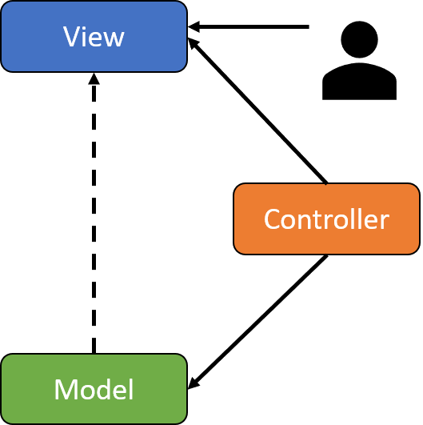

<!-- _class: title-->

# MVVM Pattern
## Nico Vogel und Lukas Sopora

12.12.19

---

# Agenda

1. Welches Problem geht MVVM an?
2. Anwendungsbereiche
3. Was ist MVVM?
  3.1. Bestandteile
  3.2. Zusammenspiel
4. Vergleich mit MVC
5. Demo
6. Kritische Würdigung

<!-- 
1. was geht mvvm überhaupt an
2. wo wird es eingesetzt
3. was ist mvvm anhand von c# wpf
3.1 dabei reden wir über die bestandteile
3.2 und wie diese zusammenspielen
4. danach vergleichen wir  mvc mit mvvn
5. noch eine kleine demo
6. und zuletzt heben wir die vor und nachteile von MVVM im c# bereich hervor
-->

---

# 1. Welches Problem geht MVVM an?

- Starke Abhängigkeit zwischen UI und Logik
- Fehlende Abstraktion der View
- Redesign problematisch
- Cross Platform
- **TODO** weitere finden!!!

<!--
*Vorwort*: 
generell kommt es auf die ausgangassituation an, wie stark die folgenden punkte gewogen werden.

1. UI und Logik ist ein code, was schwer zu warten ist
2. da die UI und die logik viel miteinander zu tun haben kann man nicht einfach das design ändern. dabei zerstört man wahrscheinlich viele funktionen usw.
3. Es muss viel logik neu für jede plattform geschrieben werden

*schlusswort*:
wenn beispielweise Application Layer angewand wird, ist punkt 3 schonmal deutlich weniget schlimm, da man bereits eine saubere trennung zwsichen UI und Logik hat.
-->

---

# 2. Anwendungsbereiche

MVVM wird eingestzt von:

- C# WPF *(Ursprung)*
- Silverlight
- AngularJS *(nicht Angular...)*
- Delphi

<!-- 
Im weiteren werden wir alles anhand von C# WPF erläutern
 --> 

---

# 3.1. Was ist MVVM - Bestandteile?

<span>


</span>

- Informationsaustausch
  - Binding
  - Command
  - Events

<!-- 
generell lässt sich das MVVM patter in Komponenten und deren Informationsfluss aufteilen.
 -->

---
<!-- _class: code -->
<span>

# 3.1. Was ist MVVM? - Model

- POCO (aka POJO)
- Nur Daten und Daten Logik (z.B. Validierung)

</span>

```` C#
public class StudentCollection
{
    public IList<Student> Students { get; }
    public IList<Student> FullAgeStudents 
    { 
        get 
        {
            return this.Students.where(x => x.Age >= 18).toList();
        }
    }
}
````

---
<!-- _class: code -->
<span>

# 3.1. Was ist MVVM? - ViewModel

- Schnittstelle zwischen UI und Logik
- Zusammenführung von Daten und Funktionen 
- Verwendung beliebig vieler Models

</span>

````C#
public class StudentViewModel
{
    public StudentCollection ClassBook { get; }

    public StudentViewModel()
    {
        ClassBook = new StudentCollection();
        ClassBook.Students.Add(new Student("Andi Theke", 19, GenderType.Male));
    }
}
````

---
<!-- _class: code -->
<span>

# 3.1. Was ist MVVM? - View

- Keine Programmlogik, lediglich Rendering
- Kennt genau ein ViewModel
- "Sucht" sich die notwendigen Informationen aus dem ViewModel

</span>

````XML
<ListView>
    <ListViewItem>
        <DockPanel>
            <TextBlock Text="Andi Theke"/>
            <TextBlock Text="19"/>
            <TextBlock Text="Male"/>
        </DockPanel>
    </ListViewItem>
</ListView>
````

---
<!-- _class: code -->
<span>

# 3.1. Was ist MVVM? - Binding

- Definition von Bindings in der View
- Informationsaustausch zwischen View und ViewModel 

</span>

````XML
<ListView ItemsSource="{Binding ClassBook.Students}">
    <ListView.ItemTemplate>
        <DataTemplate>
            <DockPanel>
                <TextBlock Text="{Binding Name}"/>
                <TextBlock Text="{Binding Age}"/>
                <TextBlock Text="{Binding Gender}"/>
            </DockPanel>
        </DataTemplate>
    </ListView.ItemTemplate>
</ListView>
````

---
<!-- _class: split-->

# 3.1. Was ist MVVM? - Binding

<div class="ldiv">

## OneWay Binding

View ← ViewModel

oder

View → ViewModel
(OneWayToSource)

</div>
<div class="rdiv">

## TwoWay Binding

View ⮀ ViewModel 

</div>

--- 

# 3.1. Was ist MVVM? - Commands

beschreiben was ein command ist und wie man den einsetzt
- Event: Methode in CodeBehind der View

---

# 3.1. Was ist MVVM? - Events

beschreiben das es bestimmte ausnahmen gibt in denen man ein event verwenden muss, weil kein command zur verfügung steht. DAS ABER NUR ANREIßEN

---

# 3.2. Was ist MVVM? - Zusamenspiel

1. wie agieren View, ViewModel und Model miteinander ("übersicht")
2. extended version von 1, wo mehrere Views zu sehen sind ("relation")
3. einordnung in Application Layered

---

# 4. Vergleich mit MVC

- MVC
- vergleich MVC und MVVM
<!-- mal schauen ob wir MVP nicht rausschmeißen wegen zeit -->
- MVP
- vergleich MVP und MVVM

---

# 4. Vergleich MVC - MVC

bild von MVC

---

# 4. Vergleich MVC und MVVM

<div class="ldiv">

### Model View Controller



</div>

<div class="rdiv">

### Mode View ViewModel


</div>

---
<!-- _class: title -->

# 5. Demo

---
<!-- _class: split-->

# 6. Kritische Würdigung

<div class="ldiv">

## Pro

<span class="text-left">

- flexibel

</span>
</div>

<div class="rdiv">

## Con

<span class="text-left">

- viel code für wenig resultat

</span>
</div>

---
<!-- _class: title -->

# Danke für Eure Aufmerksamkeit